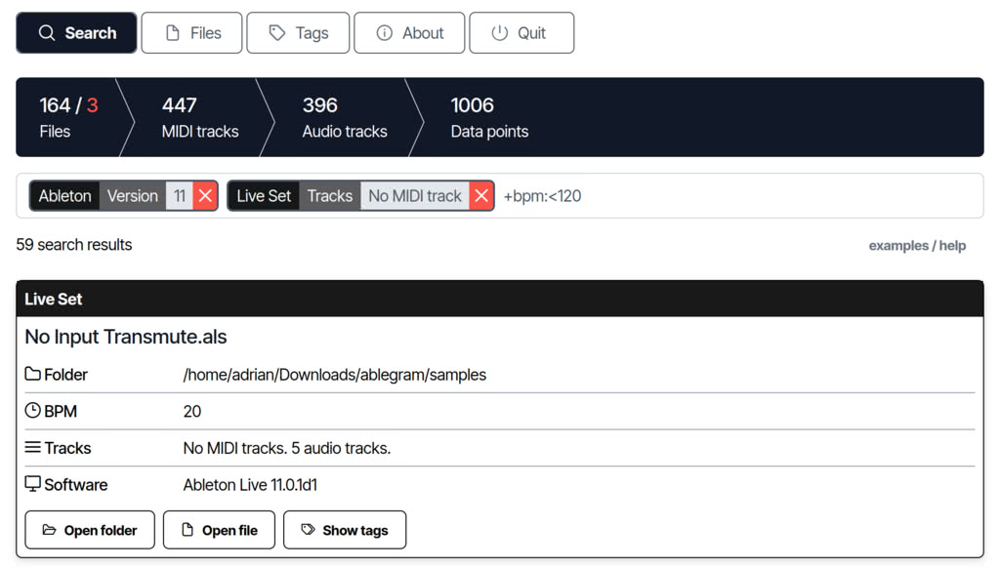

# Ablegram: Your Ableton project file finder

Ablegram is a free and independent tool designed with Ableton users in mind, although it's not directly affiliated with Ableton. This easy-to-use software allows you to effortlessly navigate through your Ableton project files.

As a standalone application, Ablegram requires no installation or online connectivity. It's designed to work effectively across Windows, (hopefully soon) MacOS and Linux platforms.

## Features

- Cross-platform: Ablegram is designed to be platform independent. Whether you're using Windows, MacOS or Linux, you can use the tool with ease.

- No installation required: Just download and run. No installation steps are required, ensuring a hassle-free experience (as far as the OS allows).

- Offline functionality: Use Ablegram completely offline. No Internet connection or subscription plans are required.

- Comprehensive indexing: Ablegram creates a full text index of your Ableton files - covering Live Sets, audio tracks and MIDI tracks.

- Search Flexibility: Search your files using text components or tags. Ablegram makes it easy to find what you're looking for in your projects.

## Getting Started

Follow these simple steps to get your software up and running:

1. Go to the [Release](https://github.com/adrianrudnik/ablegram/releases) tab and grab the appropriate binary for your system.

2. Launch the binary. A user interface will appear. In most cases, your browser will also automatically navigate to the endpoint of the software. If it doesn't, the UI will provide an option to launch the browser. If all else fails, manually access the service at http://localhost:10000.

3. The first time you run the software, your operating system may prompt you for firewall and file system access due to the software's file handling and web server setup. Please grant the necessary permissions to ensure smooth operation.

The software is designed to leave no footprint. If you avoid saving settings or activating debug/logging modes, it will leave no traces after closing. All tasks are performed in memory without creating any temporary files.

## Feedback & Support

For general feedback, questions, or any form of discussion, please use the [Discussions tab](https://github.com/adrianrudnik/ablegram/discussions) on the GitHub repository.

If you've found a bug or want to suggest a new feature, please [open an issue](https://github.com/adrianrudnik/ablegram/issues) or head over to the [idea discussions](https://github.com/adrianrudnik/ablegram/discussions/categories/ideas) in the repository. This helps me track and resolve issues effectively.

For more detailed inquiries, or if you prefer a direct line of communication, you can email me at [support@ablegram.app](mailto:support@ablegram.app).

Remember, by actively providing feedback or raising concerns, you're helping to improve of the project. I appreciate your support input!

## Contribute

Being open source, contributions to improve Ablegram are always welcome. Feel free to fork the project, make your changes and submit a pull request.

See the [BUILDING.md](docs/BUILDING.md) document for guidelines on how to build the project.

Before submitting your pull request, please consult the [CONTRIBUTE.md](docs/CONTRIBUTE.md) for detailed contribution steps and best practices.

## Donations / Funding

Although the software is freely available to everyone, it takes a lot of time and effort to maintain and improve. If you find value in this project and use it for commercial purposes, your financial support would be greatly appreciated.

Where your support goes:

- Project maintenance: Direct support to ensure that I can continue to devote time and resources to improving and maintaining the software.

- Vendor costs: A portion of your contribution also goes towards my vendors, the unsung heroes behind the tools, services and resources that make this project possible. By supporting them, we ensure the sustainability and quality of the backbone of this software.

By supporting me financially, you're not only supporting the future of the software, you're recognising the collective effort that makes it possible. Every contribution, big or small, plays a vital role in the project's journey. 

Thank you for your generosity and belief in this work.

## Disclaimer

While our software is freely available for everyone, maintaining and improving it involves considerable time and effort. If you find value in our project and utilize it for commercial purposes, your financial support would be immensely appreciated.
